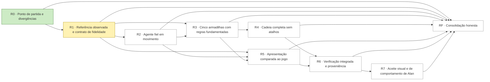

# Gauntlet — fidelidade-eg2

Preparado em 2026-10-02. **Goal ativo no Codex; R0 concluída e R1 em andamento.** O pedido de Alan autoriza a execução deste objetivo nesta conversa. A preparação do livro não é prova de fidelidade. O estado vive no livro `prototypes/evil-genius-2-trap-arena/docs/gauntlet-fidelidade-eg2.json`; este documento é a receita.

## Texto para colar

```text
/goal Reproduzir o recorte do agente e de ventilador, luva, bolha, piso escorregadio e laser de Evil Genius 2 com fidelidade visual e comportamental verificável na arena web isolada, eliminando diferenças materiais observadas no jogo real (prototypes/evil-genius-2-trap-arena), pelo livro prototypes/evil-genius-2-trap-arena/docs/gauntlet-fidelidade-eg2.json e pela receita prototypes/evil-genius-2-trap-arena/docs/gauntlet-fidelidade-eg2.md. Comece com `python3 squads/goal-gauntlet/scripts/gauntlet.py placar prototypes/evil-genius-2-trap-arena/docs/gauntlet-fidelidade-eg2.json` e `python3 framework/scripts/game.py context prototypes/evil-genius-2-trap-arena --event resume`; se outra sessão escreve no alvo ou o placar mostra outro escritor, combine a passagem antes de escrever (`assumir --escritor <esta sessão>`: um escritor por vez). Trabalhe com a skill game-dev. Uma rodada por vez, na ordem das dependências: `marcar <id> em-andamento`, faça, e só conclua com `python3 squads/goal-gauntlet/scripts/gauntlet.py fechar prototypes/evil-genius-2-trap-arena/docs/gauntlet-fidelidade-eg2.json <id> --prova "<o que e onde>"`, que roda os gates. Nunca edite critério, rodada ou gate do livro. Duas tentativas sem evidência nova: `marcar <id> bloqueada --motivo … --desbloqueia …` e siga para a próxima elegível; escolha que só Alan faz vira `aguarda-alan --decisao …`. Não invente número, tarefa nem prova. Limites: Só o protótipo; biblioteca em leitura e Rabisco preservados. Sem commit, push, publicação, instalação ou troca de motor. Comparar movimento com gameplay real; testes verdes não provam fidelidade. Rodada bloqueada não satisfaz o objetivo. Pronto quando `python3 squads/goal-gauntlet/scripts/gauntlet.py placar prototypes/evil-genius-2-trap-arena/docs/gauntlet-fidelidade-eg2.json` imprimir GAUNTLET FECHADO nesta conversa, com a rodada final fechada pelo `fechar`, que roda os gates globais (`node --check simulation.js` em prototypes/evil-genius-2-trap-arena; `node --check actor.js` em prototypes/evil-genius-2-trap-arena; `node --check app.js` em prototypes/evil-genius-2-trap-arena) e mostra cada um saindo 0; então resuma concluídas, bloqueadas com o que as destrava e as decisões pendentes de Alan.
```

## Objetivo e pronto quando

- **Objetivo:** Reproduzir com fidelidade visual e comportamental verificável o agente e as cinco armadilhas de Evil Genius 2 na arena web isolada.
- **Alvo:** `prototypes/evil-genius-2-trap-arena` (jogo).
- **Pronto quando:** `python3 squads/goal-gauntlet/scripts/gauntlet.py placar "prototypes/evil-genius-2-trap-arena/docs/gauntlet-fidelidade-eg2.json"` imprime `GAUNTLET FECHADO`
  na conversa, e os gates globais saem 0. Isso fecha a execução administrativa do gauntlet. O objetivo de fidelidade só está atingido com 34/34 comparações sem diferença material ou unknown relevante e aceite de Alan registrado. Rodadas bloqueadas ou aguarda-alan são entrega parcial; o goal ativo não pode ser marcado complete nesse estado.

## Onde estamos

Os tópicos abaixo preservam o baseline da preparação/R0. O estado atual da investigação está em `game-design.md`, `evidence/native-source-audit.json` e na nota de R1 do livro: 52 clipes HCAN decodificados, seletor TRPA reproduzido, 144 janelas de bytes nativos validadas e comparação qualitativa de gameplay registrada. A caminhada HCAN já está integrada na arena, com 13/13 verificações; avanço linear derivado do canal extra e revólveres extraídos anexados sem offsets. A bancada conserva 22/22. As cinco poses de reação loop agora são extraídas (35/35 verificações de aplicação); regras, inputs e eventos ainda são reconstruídos. `evidence/native-walk-integration.json` registra a versão; essas provas não fecham os 34 casos de fidelidade.

- Arena Three.js funcional em `prototypes/evil-genius-2-trap-arena`, consumindo 49 arquivos allowlisted da biblioteca: `asset-manifest.json`. Nove modelos, texturas e seis sons extraídos; não executar os gates da biblioteca de origem, que é somente leitura.
- Personagem usa 81 ossos nativos e oito influências de skinning; gait e reações procedurais em `actor.js`, sem reprodução dos HCAN. `evidence/walking-qa.json` prova articulação e movimento técnico, sem atestar fidelidade.
- `simulation.js` e `rules.json` são reconstrução com tempos e danos assumidos. A bolha força +x, o piso aplica impulso próprio e `hits.includes(type)` impede novos acertos do mesmo tipo. Combo atual equivale à lista de cinco tipos, sem provar continuidade do original.
- `evidence/web-qa.json` e `evidence/live-chain.json` provam controles e a cadeia programada. Os testes atuais não demonstram o comportamento real de Evil Genius 2. O usuário recusou esse comportamento e exigiu equivalência com o original.
- Capturas anteriores e vídeos estão no Drive, com recibo `evidence/web-media.json`. Preservar o antes como baseline; não sobrescrever sua proveniência com resultados novos.
- Investigação original em `original-client-investigation.md`: cliente Windows x64 não foi executado neste host. Alan autorizou depois reconstrução web com a biblioteca. Asura não roda aqui.
- Candidatas vistas: imagem oficial Trap Combos; vídeo oficial Sandbox Mode `https://www.youtube.com/watch?v=yT4ExiSqcUE` (19,88–20,38s, enquadramento amplo, insuficiente para medir a reação inteira); vídeo de gameplay `https://www.youtube.com/watch?v=SzNHirYm2uw` (10,96s, laser); vídeo `https://www.youtube.com/watch?v=H8SlL7RRNBo` localizado, não observado em movimento. Ver novamente e localizar trechos úteis antes de usar como esperado.
- O manifesto de animações `libraries/evil-genius-2/assets/animations/clips.json` possui 7.871 registros HCAN, extração de cabeçalhos; payloads comprimidos ainda opacos. Nomes e durações de cabeçalho não comprovam playback nem semântica de combate.

## Contrato de comparação

34 casos fixados no livro: 5 do agente, 4 de cada uma das cinco armadilhas, 4 de cadeia e 5 de apresentação. Evidência por caso: origem, timecode ou campo decodificado, comportamento observado, esperado, métrica e precisão da fonte, resultado no protótipo final, diferenças restantes e link/hash de captura. Um valor unknown bloqueia o caso relevante, sem substituição silenciosa por assumed.

A lente é fidelidade ao recorte original. O cenário de sucesso é observar o agente caminhar e atravessar a cadeia inteira, com as reações e a recuperação correspondentes ao jogo real, inclusive quando a montagem impede a cadeia. Não é copiar toda a campanha.

Gates de sintaxe/regressão são suporte técnico. Evidência comparativa e revisão em movimento sustentam o julgamento de fidelidade. Os critérios não serão afrouxados para passar.

## Rodadas

<!-- gauntlet:rodadas -->
| Rodada | Entrega | Fecha quando | Depende | Estado |
|---|---|---|---|---|
| **R0** | Ponto de partida e divergências | Baseline reproduzível com hashes e testes; divergências conhecidas numeradas em game-design.md; nenhuma regressão ou aprovação antiga reinterpretada como fidelidade. | — | concluida |
| **R1** | Referência observada e contrato de fidelidade | 34 de 34 casos inventariados com fonte e observação direta ou lacuna explícita; diferenças iniciais enumeradas; contrato numérico tem resolução e origem. Lacuna relevante impede fechar a rodada como concluída. | R0 | em-andamento |
| **R2** | Agente fiel em movimento | 5 de 5 casos de agente sem diferença material na comparação em movimento; origem das animações e regras explícita; transições não usam teleporte nem retorno instantâneo; teste de caminhada verde. Animação procedural sem comparação verificável não satisfaz o critério. | R1 | aberta |
| **R3** | Cinco armadilhas com regras fundamentadas | 20 de 20 casos das cinco armadilhas comparados ao original sem diferença material aberta; parâmetros relevantes têm fonte, não assumed; casos negativos e de recuperação passam. Os valores antigos não são o esperado de referência. | R1, R2 | aberta |
| **R4** | Cadeia completa sem atalhos | 4 de 4 casos de cadeia passam; cinco dispositivos no mesmo agente em execução ao vivo; alterar montagem ou elegibilidade muda o resultado; nenhuma passagem é forçada por direção +x, teleporte, script de sequência ou dano ajustado só para terminar. | R3 | aberta |
| **R5** | Apresentação comparada ao jogo | 5 de 5 casos de apresentação comparados em movimento, com fontes, capturas e diferenças numeradas; zero divergência material aberta no recorte; nenhuma redução de qualidade para alcançar FPS. | R1, R2, R3 | aberta |
| **R6** | Verificação integrada e proveniência | 34 de 34 casos verificados na versão final, sem unknown relevante ou diferença material aberta; QA técnico verde; mídia e parâmetros rastreáveis; navegador mostra a versão funcional. Um PASS técnico não fecha por si só a fidelidade. | R4, R5 | aberta |
| **R7** | Aceite visual e de comportamento de Alan | Alan aprova explicitamente o recorte em movimento como fiel ao jogo real, com mensagem citada; autorrevisão e testes automáticos não contam como sua aprovação. | R6 | aberta |
| **RF** | Consolidação honesta | Gates finais verdes; documentação corresponde ao runtime; resultado distingue atingido de parcial; goal nunca marcado complete com divergência relevante, unknown, rodada bloqueada ou aceite de Alan ausente. | R0, R1, R2, R3, R4, R5, R6, R7 | aberta |
<!-- /gauntlet:rodadas -->

<!-- gauntlet:dag -->

<!-- /gauntlet:dag -->

## Regras

- **Uma rodada por vez**, na ordem das dependências. `placar` mostra as elegíveis. Comece uma rodada com
  `gauntlet.py marcar "prototypes/evil-genius-2-trap-arena/docs/gauntlet-fidelidade-eg2.json" <id> em-andamento`.
- **Só `fechar` conclui.** O `gauntlet.py fechar "prototypes/evil-genius-2-trap-arena/docs/gauntlet-fidelidade-eg2.json" <id> --prova "<o que foi entregue e onde>"` roda os gates
  da rodada e os globais pelo `game.py verify` e grava o recibo. Gate vermelho mantém a rodada aberta.
- **O livro está selado.** Critério, rodadas, dependências e gates não mudam durante a execução. Mudar exige pedido de
  Alan e `gauntlet.py selar --motivo`. Apagar ou afrouxar um gate para passar é falha, não progresso.
- **Número sem origem fica desconhecido.** O código mede, não calibra. Um PASS estrutural não prova conteúdo: a
  `--prova` diz qual artefato sustenta o critério.
- **Sem avanço, muda a hipótese.** Duas tentativas sem evidência nova bloqueiam a rodada:
  `marcar <id> bloqueada --motivo … --desbloqueia …`. Depois, siga para a próxima elegível. Uma escolha que só Alan
  faz vira `aguarda-alan --decisao …`.
- **Revisão própria se declara como própria.** Um crítico independente só entra com autorização e isolamento.

## Fora

- Sem commit nem push sem pedido de Alan; publicar é pelo gameops.
- Caminhos portáveis (relativos, <repo-root>, ~); nenhum caminho absoluto de máquina, .env, chave ou credencial em arquivo versionado.
- Preservar alterações de outras sessões: um escritor por área; não matar processo que esta sessão não iniciou.
- Testes headless com a GPU real (--use-angle=metal --ignore-gpu-blocklist), sem Claude in Chrome e sem roubar foco.
- O piso visual e sonoro aprovado não se troca por desempenho, custo ou prazo.
- Vídeos, renders e capturas vão para o acervo do Drive, não para o Git.
- Subagente só no modelo mais barato capaz, com brief fechado e conferência na fonte; julgamento visual e revisão crítica ficam na sessão principal.
- Decisão de design aprovada só muda com Alan; uma variável por vez quando a causa importa.
- Continuidade no canônico do framework (Devlog/plano); game.py context antes de cada fatia.

- Escrever somente no protótipo; Rabisco e biblioteca preservados. Usar a reconstrução Three.js já autorizada e declarar sua origem.
- Nunca confundir checklist fechado com objetivo de fidelidade atingido. Não inventar originalidade, observação ou aprovação.

## Decisões que só Alan toma

1. Aceite visual e de comportamento do recorte em movimento na R7. O agente apresenta a comparação pronta; enquanto não houver aprovação explícita, registra aguarda-alan.
2. Compra, instalação, publicação ou mudança de motor não estão autorizadas por este goal; não são pré-requisitos inventados para o recorte web.

## Retomada

Pré-condições dos gates de navegador: servidor local ativo, Chrome instalado e Playwright do runtime existente resolvido pelo `NODE_PATH` da sessão. Localizar com `load_workspace_dependencies`; não instalar outro runtime. Configurar `EG2_QA_OUT` para uma pasta externa de mídia de cada rodada, preservar o baseline e enviar as novas provas ao Drive. A configuração da máquina fica fora dos arquivos versionados. Se o gate falhar por ambiente, registrar a causa e resolver o ambiente antes de classificar como defeito do protótipo.

1. Rode `python3 squads/goal-gauntlet/scripts/gauntlet.py placar "prototypes/evil-genius-2-trap-arena/docs/gauntlet-fidelidade-eg2.json"` e depois o contexto: `python3 framework/scripts/game.py context prototypes/evil-genius-2-trap-arena --event resume`.
2. Uma rodada `em-andamento` recomeça pelo gate. Um recibo antigo não vale como atual.
3. O `/goal` volta sozinho com `claude --continue` ou `--resume`, com a contagem de turnos zerada. No Codex, use
   `/goal resume`. O livro é a fonte do estado, não a memória da conversa.

## Fontes

- Livro: `prototypes/evil-genius-2-trap-arena/docs/gauntlet-fidelidade-eg2.json`. Skill: `squads/goal-gauntlet/SKILL.md`.
- `framework/references/gauntlet.md`
- `framework/references/process.md`
